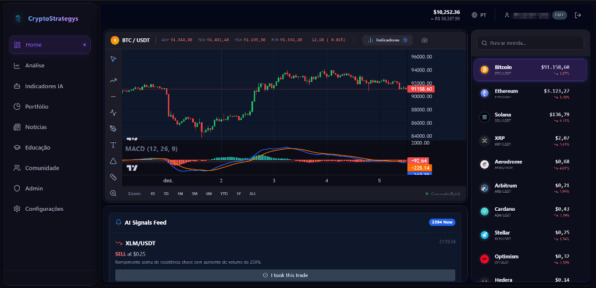
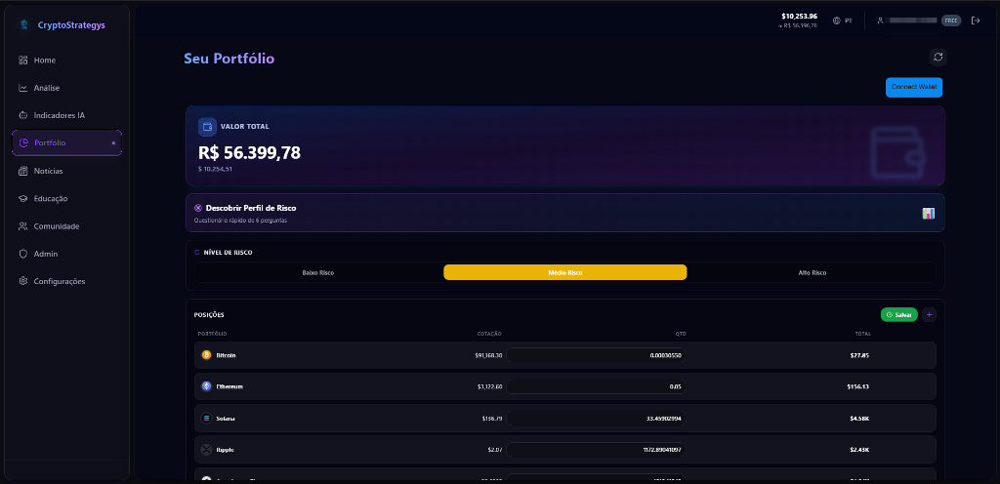

# CryptoStrategys 🚀

CryptoStrategys is a comprehensive cryptocurrency dashboard and portfolio management platform powered by AI insights and real-time market data.

## 🌟 Features

### 📊 Interactive Dashboard
- **Real-time Market Data:** Live price updates via WebSockets (Bybit integration).
- **Advanced Charts:** Interactive TradingView-style charts with drawing tools and technical indicators.
- **Top Movers:** Instant visibility on top gainers and losers.

### 💼 Portfolio Management
- **Asset Tracking:** Track your crypto holdings with real-time valuation in USD and BRL.
- **Risk Analysis:** AI-powered risk assessment of your portfolio distribution.
- **Transaction History:** Record buys and sells to keep your history accurate.

### 🤖 AI Strategies & Signals
- **Automated Analysis:** Technical indicators (RSI, MACD, Moving Averages) generated automatically.
- **Signal Feed:** Get buy/sell signals based on configured strategies.
- **Backtesting:** (In progress) Validate strategies against historical data.

### 🌍 Market Analysis
- **Coin Details:** Deep dive into individual assets with news, sentiment analysis, and key metrics.
- **News Feed:** Aggregated crypto news provided by reliable sources.

## 📂 Estrutura do Projeto

```
crypto-strategys/
├── backend/           # API Node.js & Serviços
│   ├── scripts/       # Scripts utilitários (testes manuais, migrações)
│   ├── sql/          # Schemas do Banco de Dados
│   └── tests/        # Testes específicos do Backend
├── md/               # Documentação e Tutoriais
├── public/           # Assets estáticos públicos
├── src/              # Frontend React
│   ├── assets/       # Imagens e Fontes
│   ├── components/   # Componentes Reutilizáveis
│   ├── pages/        # Páginas da Aplicação
│   ├── services/     # Integração com APIs
│   └── tests/        # Testes Unitários do Frontend
├── tests/            # Scripts de Teste Automatizados (E2E, API, Pentest)
└── ...arquivos de configuração
```

## 🧪 Testes

O projeto possui uma suíte completa de testes automatizados.

### 🚀 Rodar Todos os Testes
Para executar a bateria completa (API Flow, Admin, Segurança):
```bash
npm run test:full
```

### 🎯 Outros Comandos
- **Testes Unitários:** `npm test` (Vitest)
- **Testes E2E (API):** `npm run test:e2e`
- **Linting:** `npm run lint`

## 🛠️ Technology Stack

- **Frontend:** React, Vite, TailwindCSS, Lucide Icons, Recharts
- **Backend:** Node.js, Express
- **Database:** SQLite (Development) / PostgreSQL (Production ready)
- **External APIs:** Bybit (via WebSocket), CoinGecko, CoinCap

## 🚀 Getting Started

### Prerequisites
- Node.js (v18 or higher recommended)
- npm or yarn

### Installation

1.  **Clone the repository:**
    ```bash
    git clone https://github.com/alexandretisaito-gif/crypto.git
    cd crypto
    ```

2.  **Install Dependencies:**
    ```bash
    npm install
    cd backend
    npm install
    cd ..
    ```

3.  **Run the Application:**
    You can start both frontend and backend concurrently with a single command:
    ```bash
    npm run dev:all
    ```

    Alternatively:
    - Frontend: `npm run dev` (Runs on http://localhost:5173)
    - Backend: `cd backend && npm run dev` (Runs on http://localhost:3001)

## 🔄 Recent Updates (v6)
- **Enhanced Deduplication:** Fixed issues with duplicate coin listings in widgets.
- **Unified Pricing:** Synchronized price calculations between Dashboard and Portfolio for consistent total values.
- **UI/UX Improvements:** Cleaned up sidebar navigation and improved asset selection modals.

## 📸 Screenshots

<div align="center">
  <h3>Landing Page</h3>
  
  
  <h3>Interactive Dashboard</h3>
  

  <h3>Plans & Portfolio</h3>
  
</div>

## 📝 License
Proprietary software. All rights reserved.
